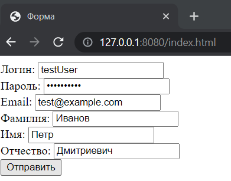
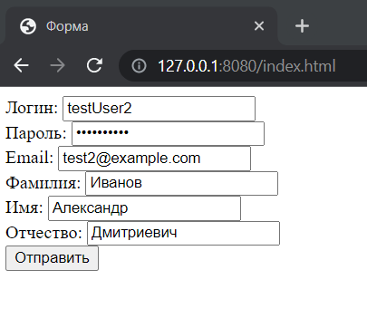
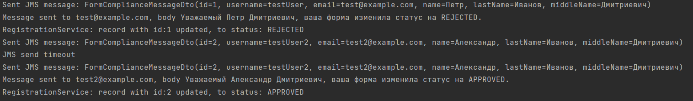

# SKBLAB тестовое задание java(Spring)
Моисеев Артём tg: @moiseev.org

## Краткое описание 
Форма регистрации с отправкой е-мейла после одобрения внешней системой.

## Реализация
#### Cтек
Spring: 2.7
DBMS - h2
Lombok.
#### Краткое описание реализации
Решение построено на базе порождении и отработки событий. В данном случае это позволяет достичь асинхронной отправки формы на одобрение, а также асинхронной отправки сообщения на электронную почту. 
По основным моментам в коде имеются комментарии.
## Демонстрация работы
Форма 1:

Форма 2:

Результат:

## Запуск
1. Выполните команду: `mvn spring-boot:run`
2. Форма будет доступна по адресу: `127.0.0.1:8080/index.html`
